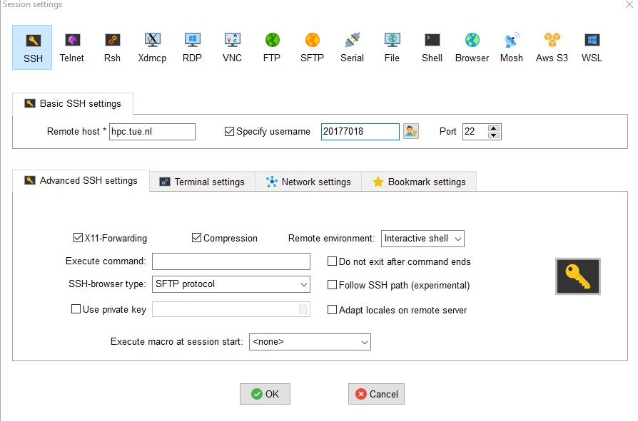
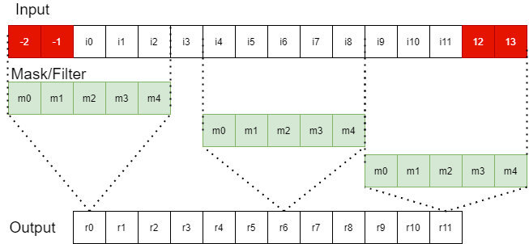
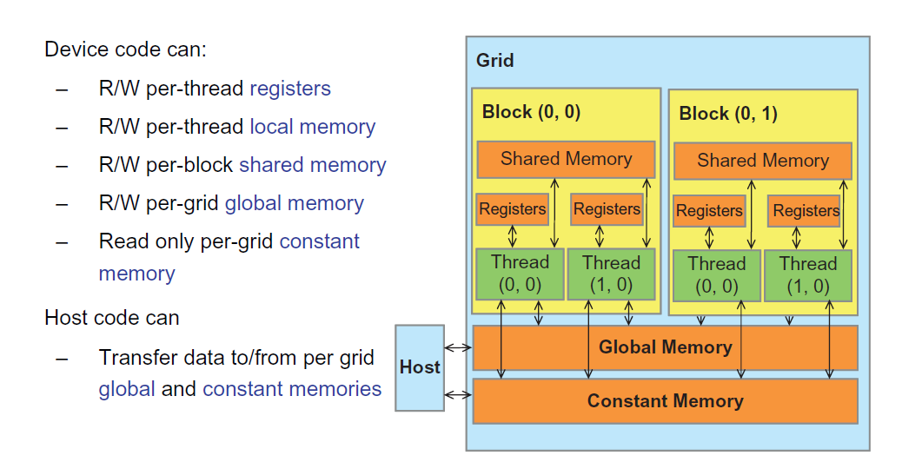

# ECA-Lab2 GPU programming

GPU is one of the most popular platforms which are designed for speeding up applications on CPU. Unlike CPU, GPU can handle tremendous threads in parallel which can potentially bring a significant speed-up. In this lab, you will learn to how map sequential CPU programs on GPU via CUDA programming language. 

You will be provided with two image processing kernels in C. You tasks are to map these two kernels on Nvidia GPU with CUDA programming language. You will need to profile your implementations and analyze the speed-up you can get. 

<!-- In this Assignment, you will be asked to optimize the 2d convolution on GPU. To ease your GPU programming journey, we will first start with 1D convolution example. Some optimization techniques will be introduced in 1D convolution exercise. Then you will be asked to implement 2D convolution by CUDA and apply (as much as possible) effective GPU optimizations to speed-up your Naive CUDA implementation.  -->


<!-- This assignment consists of two parts, the first part is a 1D convolution exercise to guide you how to build CUDA program through step-by-step instructions. The second part is 2D convolution CUDA programming task where you have more freedom to practice what you have learned. You are free to apply whatever optimization techniques you want. You need to explain your implementation and optimization techniques you used, and test the speed-up gains of your implementation under different problem sizes as well your reasoning of the speed-up gains in your report. -->


<!-- # 1D Convolution exercise
This simple exercise will help you quickly start CUDA programming, if you have understood the concepts we introduced in lab tutorial, then this exercise should be straightforward and easy for you. -->

# Preparation
We will use the university HPC cluster for GPU assignment. You can login using your student number (e.g. 20177347) and corresponding password(**Password is the one you use for your TU/e Email and TU/e VPN should be enabled**). .If you are not familiar with SSH, just google it and you will find plenty of methods of how to login in a server through SSH terminal. For windows user you can use [MobaXterm](https://mobaxterm.mobatek.net/). And create a session like this 


<div align=center>

</div>

Where you should replace the username with your own. 


Once you login, check if you have access to the GPU
```
sinfo 
```
You should see 
```
5SIA0.elec.q      up   infinite      1    mix elec-gpuA001
```


Then you can git clone GPU lab codes and do some tests
```
git clone https://gitlab.tue.nl/20177018/gpu2021.git
cd gpu2020/MatrixMultiplication/CUDAtiling
sbatch run_prog.run
```

In above commands, we submit our task to GPU cluster through 
```sbatch ```. ```run_prog.run``` is the script for allocating resources and submitting job. More details can be found in [HPC Wiki](https://hpcwiki.tue.nl/wiki/Main_Page) .

If you successfully uploaded your job, you can see something like  
```
Submitted batch job [#]
```

After waiting several minutes/seconds, you will get two files

```
slurm-[#]].err  slurm-[#].out
```
where you can find the results (for instance, your printf function in your C program) in slurm-[#].out
```
nvcc Matmul.cu kernel.cu -o app
Matrix Size : 512 x 512
GPU Device 0: "GeForce RTX 2080 Ti" with compute capability 7.5
Start CPU processing
Naive CPU processing time: 839.198 ms
start Naive GPU processing
block Dim  32 x 32
Grid Dim  16 x 16
CUDA kernel processing time: 1.79994 ms
speed-up : time_CPU/time_GPU 466.238
start GPU improvement processing
block Dim  32 x 32
Grid Dim  16 x 16
CUDA kernel processing time: 1.36442 ms
speed-up : time_CPU/time_GPU_Improvement 615.06
speed-up : time_GPU_Naive/time_GPU_Improvement 1.3192
Total Errors = 0
```

## Study Matrix Multiplication cookbook

Before you start the programming tasks, you are strongly recommended to read our [matrix multiplication cookbook](https://ecatue.gitlab.io/gpu2018/pages/Cookbook/matrix_multiplication_cuda.html) and understand the introduced optimization techniques. The contents in [matrix multiplication cookbook](https://ecatue.gitlab.io/gpu2018/pages/Cookbook/matrix_multiplication_cuda.html) will **possibly be treated in the final exam**. Note, you only need to read the material and do not clone the old codes. We provide new codes this year (in MatrixMultiplication folder), feel free to modify the codes and test different matrix sizes.


# Image processing kernels
We provide two image kernels - greyscale.c and  


<div align=center>

</div>

<div align=center>
Fig 1: 1D Convolution.
</div>

Figure 1 demonstrates 1D convolution which consists of Input array, Mask array and Output array. Each output element is calculated with Mask and Input. For instance, Output[6] (r6) in this example is calculated by:

<div align=center>
r6  = i4 * m0 + i5 * m1 + i6 * m2 + i7*m3 + i8* m4 
</div>


Just like what we have discussed in 1D stencil example in the tutorial, the values outside input range (e.g. red boxes in Figure 1) will be set as 0. So, r0 is calculated by :


<div align=center>
r0  = 0 * m0 + 0 * m1 + i0 * m2 + i1*m3 + i2* m4
</div>

The following code listing is the C implementation of 1D convolution algorithm. It consists of two for loops, where the outer one indicates the output index and the inner loop is the computation part. The **if** statement in the inner loop is the boundary checker. If the input index (**In_start_point**) oversteps the input range, then no multiplication will be taken because we set the values outside range as 0.

```c++
void convolution_1D_host(float *in, float *m, float *out, int Mask_Width, int Width) {
    for(int i = 0; i<Width;i++){
        float Res = 0;
        int In_start_point = i - (Mask_Width/2);
        for (int j = 0; j < Mask_Width; j++) {
            if (In_start_point + j >= 0 && In_start_point + j < Width) {
                Res += in[In_start_point + j]*m[j];
            }
        }
        out[i] = Res;
    }
} 
```

## The 1D convolution: Naive CUDA implementation

1D convolution has many similarities with 1D stencil we introduced in the tutorial. In 1D stencil, r6 is calculated by : 

<div align=center>
r6  =  i0 + i1 +  i2 + i3 +  i4 
</div>


The only difference is that in 1D stencil, filter/mask values are **1**, so there is no need to store this constant value in an array. [1Dstencil.cu](./docs/1Dstencil.cu) provides the CUDA implementations. 

With 1D stencil implementation as a reference, we can quickly implement our Naive 1D convolution CUDA kernel. 

```c++
//float *in:  global memory pointer to input data array
//float *m:  global memory pointer to mask data array
//float *out:  global memory pointer to output data array
__global__ void convolution_1D_basic_kernel(float *in, float *m, float *out, int Mask_Width, int Width) {
    int gindex = threadIdx.x + blockIdx.x * blockDim.x;  //gloabl index
    int In_start_point = gindex - int(Mask_Width/2);//start index of input data
    float result = 0;
    for(int i = 0; i < Mask_Width ;i++){
        if( In_start_point + i >= 0   && In_start_point + i < Width ) { // boundary check
            result += in[In_start_point+i]*m[i];
        }
    }
    out[gindex] = result;
} 
```

## Programming Task 1 : Implement tiled 1D convolution

In 1D stencil tutorial, we discussed how to apply tiling and shared memory to reduce the redundant GPU global memory accesses. Due to the similarities of 1D convolution and 1D stencil, we can consider using similar techniques to speed-up our Naive 1D implementation. In this programming exercise, you need to implement tiled 1D convolution yourself. Code template can be found in 

```
gpu2020/Conv/conv1d.cu
```

You can first run the provided [conv1d.cu](./Conv/conv1d.cu) through

```
sbatch run_conv1d.run 
```
Wait and open the corresponding slurm-[#]].out file.

```
C program time  : 26.8185 ms
Naive CUDA Kernel Execution time(without data transfer time) = 0.439475 ms
Tiled Kernel Execution time(without data transfer time) = 0.0310953 ms
average errors = 3.374
 error: Check your CUDA implementation! the result is not numerically correct compared to C program
Tiled + Const Mem CUDA Kernel Execution time(without data transfer time) = 0.0236085 ms
average errors = 3.13683
 error: Check your CUDA implementation! the result is not numerically correct compared to C program
```


It indicates that C implementation and Naive CUDA implementation are successfully run, there are two errors because you should implement these two kernels yourself as programming task 1 (this section) and programming task 2 (will be introduced later}).

## Optimization technique: Constant Memory

<div align=center>

</div>

<div align=center>
Fig 2: Overview of CUDA device memory
</div>


Apart from tiling and shared memory, constant memory can be used to speed-up our implementation further. So, what is Constant memory? Figure 2 shows an overview of CUDA device memory architecture. Constant memory provides better performance than global memory in read-only mode (Think about Why?). In our 1D convolution example, it is common in practice that Mask/Filter values will not be changed. Due to this property, it is wise to move the mask/filter data array to constant memory. 

The following code piece demonstrates how to use constant memory.

```c++
//.....
#define MASK_WIDTH 255 
//.....
__constant__ float mask_const[MASK_WIDTH];

//.....

//Note the we have different argument list here
__global__ void convolution_1D_basic_const_kernel(float *in,  float *out, int Mask_Width, int Width) {
    // ....
        result += temp[threadIdx.x + j]*mask_const[j];
    // ...
}

int main(){

    //...
    float mask[MASK_WIDTH]; //host data
    //...
    // copy from host memory(CPU) to constant memory
    cudaMemcpyToSymbol(mask_const,mask,size_mask);
    // ...

}
```

## Programming Task 2 : Use constant memory

In this task, you need to use constant memory to store your Mask data array. How to use constant memory in CUDA  has been introduced in previous section. There are also some online examples which you can find online.

## Task 3 : Experiments

In order to understand of the impact of the optimization techniques under different situations (e.g. different Mask widths and Input size widths), we need to do some experiments. In this task, you are asked to test the the execution time of **1) C implementation**, **2) Naive CUDA implementation** **3)Tiled convolution** and **4) Tiled convolution with constant memory** under different problem sizes. For instance:

* Input data = [128,512,1024,4096,10240] 
* Mask width = [3,7,16,32,64,128]

We have provided the first two implementations, 3) and 4) are your programming tasks (task 1 and task 2). You are expected to **visualize** the experimental results you get in meaningful ways (e.g. using line charts). So do not directly put tables with raw data in your report.

# 2D convolution

In this task, you need to implement 2D convolution (Figure 3) in CUDA. This is a relatively open task. There are not strict requirements of how you should implement and what optimization techniques you should use. You can apply what you have learned from 1D convolution tutorial.  If you can successfully apply these two techniques, you will get base scores. If you want to get full points(10), then you need to
apply different advanced techniques (for instance, techniques in matrix multiplication cookbook) which have not been introduced in previous 1D stencil tutorial as long as you can motivate your decision in your report. 

In summary you should
* Implement a baseline 2D convolution on GPU and verify the correctness by the CPU-based implementation (conv2d_host in [conv2d.cu](./Conv/conv2d.cu)).
* Implement a optimized 2D Convolution by using tiling and constant memory 
* Apply different optimizations 
* Test the speed-up under different problem sizes and mask with.


<div align=center>

</div>

<div align=center>
Fig 3: 2D Convolution
</div>


# Submission

You should write down **a lab report(PDF)** the final submission together with **your codes**. In lab report, you should at least include

1. Your name and student number.
1. If you discuss/cooperate with your fellow students, you should explicitly write down his/her names and student numbers. Please note that every student has to write their lab report **individually**.
1. Your experiments of 1D convolution (Task 3). You are expected to explain the results you get. You should also provide some insights you get from your results. Note that explanations/insights are more important than the numbers. 
1. Explain your implementation of 2D convolution. 
   1. How you verified the correctness of your CUDA program.
   1. What optimization techniques you used. What are the impact of them under different problem sizes. Does all optimization techniques you used work well? 
   1. Experimental results and explanations/insights. 
   1. Note that you are encouraged to learn and try different optimization techniques, even though some of them may not bring a significant speed-up or even make your program slower. If you can write down what you have tried and explain the results in a good reasoning line, you still can get corresponding scores. 

You need to submit your codes in a **zip** or **tar** file. Note, do not add your PDF to zip file, you should submit your codes(zip) + report(PDF) separately. 

## Scoring

1. you can get maximum 8 points if you successfully finish
    1. 1D convolution exercise
    2. 2D convolution implementation by only applying tiling + constant memory
    3. Clear report.
2. To get full points (10),
    1. you need to apply different techniques.
    2. You should explain the techniques you applied and the impact clearly in your report.

## Final remark

Note that the lab report itself only accounts for 1 points of the overall scores (Max 10 points). You should see the assignment as **a learning material** and finish it **independently** so that you can get sufficient understanding. **The lab contents will be treated in final exam.** 